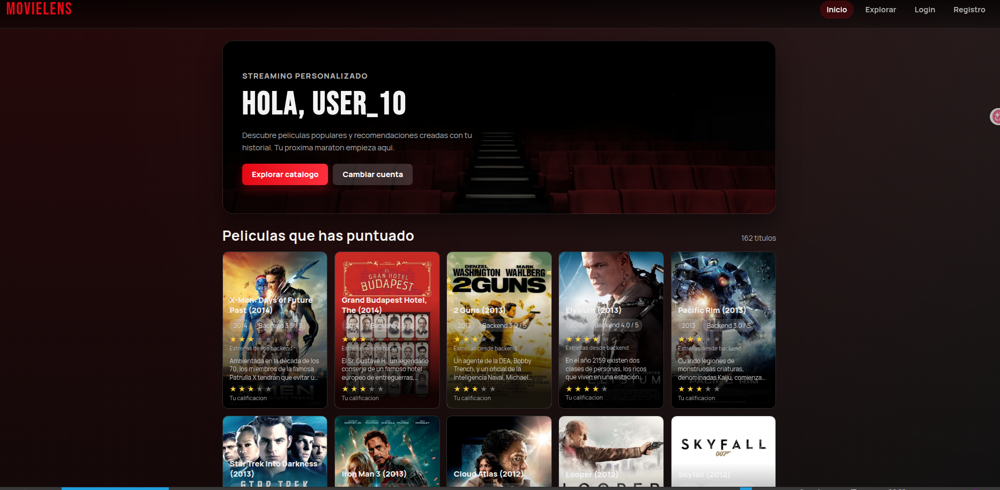
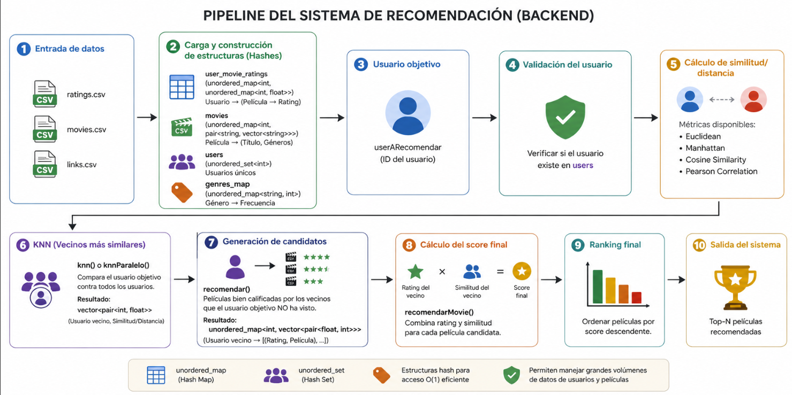

# Movie Recommendation System with C++ Backend



A movie recommendation system built in C++ using collaborative filtering, K-Nearest Neighbors (KNN), multiple similarity metrics, multithreading, and a REST API backend with Crow.

The project uses the MovieLens 33M dataset to generate personalized movie recommendations based on user ratings and similarity between users.

---

# Overview

This system was designed to simulate a real recommendation engine similar to platforms like Netflix or Amazon Prime Video.

Instead of using content-based filtering, the system applies **User-Based Collaborative Filtering**, where recommendations are generated by analyzing users with similar rating behavior.

The backend is divided into two main modes:

- `mainConsole.cpp` → debugging, testing, validation, logs
- `mainInterfaz.cpp` → REST API server for frontend integration

This separation allows safe development, validation of algorithms, and production-ready API consumption.

---

# Main Features

## Collaborative Filtering

Recommendations are generated by comparing users and identifying similar behavior based on movie ratings.

---

## Similarity Metrics

The system supports four similarity/distance metrics:

- Euclidean Distance
- Manhattan Distance
- Cosine Similarity
- Pearson Correlation

Each metric can be used independently to calculate user similarity.

---

## KNN + Parallel KNN

The project includes:

- `knn()` → sequential KNN
- `knnParalelo()` → multithreaded KNN using `std::thread`

This allows performance comparison and optimization when working with large datasets.

---

## Final Recommendation Score

The final movie ranking is computed using weighted scoring:

```text
Final Score = Neighbor Rating × Neighbor Similarity Weight
````

For:

### Euclidean / Manhattan

```text
weight = 1 / (1 + distance)
```

For:

### Cosine / Pearson

```text
weight = similarity
```

This generates a Top-N personalized recommendation list.

---

## REST API Backend

Built with Crow C++ framework.

Includes endpoints for:

* User registration
* Login system
* User authentication
* Movie search
* Ratings management
* Personalized recommendations
* Popular movies
* User statistics
* Genre filtering

The backend is designed to be consumed by a React frontend.

---

# Dataset

## MovieLens 33M

Files used:

* `ratings.csv`
* `movies.csv`
* `links.csv`

The system loads and transforms these files into optimized hash structures:

```cpp
unordered_map
unordered_set
vector<pair<>>
```

for efficient O(1) access and fast recommendation generation.

---

# Backend Recommendation Pipeline

```text
CSV Input
→ Hash Construction
→ Target User Selection
→ User Validation
→ Similarity Calculation
→ KNN
→ Candidate Generation
→ Final Score Calculation
→ Ranking
→ Top-N Recommendations
```

## System Architecture



This architecture shows the full recommendation flow from dataset ingestion to final Top-N personalized recommendations.

It includes:

* data loading from CSV files
* hash structure construction
* user similarity computation
* KNN neighbor selection
* candidate movie generation
* weighted final scoring
* ranking and recommendation output

This design allows scalability, explainability, and efficient processing for large recommendation workloads.

---

# Technical Stack

## Core

* C++
* STL
* Hash Maps
* Multithreading (`std::thread`)

## Recommendation Engine

* Collaborative Filtering
* KNN
* Similarity Metrics
* Ranking Systems

## Backend

* Crow C++
* REST API
* CORS Handling
* CSV Persistence

## Dataset

* MovieLens 33M

---

# Engineering Decisions

## Debug-first Development

Independent log files were created for:

* distance validation
* KNN analysis
* candidate generation
* final recommendation scoring

This allowed deep validation before frontend integration.

---

## Dual Entry Architecture

Separate execution flows:

* development/debugging
* production/backend server

This improves maintainability and system reliability.

---

## Parallel Optimization

KNN parallelization significantly improves scalability when processing large user datasets.

---

# Future Improvements

Possible future extensions:

* PostgreSQL integration instead of CSV persistence
* JWT authentication
* Docker deployment
* Redis caching
* Hybrid recommendation system
* Content-based filtering
* Graph-based recommendations
* Deployment on cloud infrastructure (AWS)

---

# Repository Structure

```text
header/
    recommendationSystem.h
    timer.h

source/
    recommendationSystem.cpp
    mainConsole.cpp
    mainInterfaz.cpp

out/
    debug logs
    generated reports

dataset/
    MovieLens files

frontend/
    React frontend application
```

---

# Author

Jorge Tito Ccahuaya
Computer Science — Backend Engineering / Recommendation Systems / Cloud & ML Systems

---

```
```
